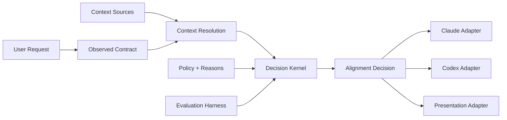

# Prompt Optimizer v4 专精化改进与完整执行方案

> 状态：执行草案。产品收敛方向已经确认；删除、重命名、默认安装行为变化和公开契约变更仍须在对应决策 Gate 单独确认。
> 日期：2026-07-15。
> 当前基线：`v3.2.0-rc.1`。
> 目标：把 Prompt Optimizer 从多能力集合收敛为 coding agent 的执行前契约门。
> 核心原则：严格约束安全下限和证据真实性，不承诺统一强弱模型的设计上限。

## 0. 文档用途与权威关系

本文是后续多会话实施 v4 专精化改进的规划 SSOT。新会话应先读本文，再只执行当前被授权的一个波次。

本文与现有文档的关系：

- [`V3.2-STABLE-IMPROVEMENT-PLAN.md`](V3.2-STABLE-IMPROVEMENT-PLAN.md) 继续负责 `v3.2.0` 稳定版收敛、证据债务和发布工程。
- 本文负责稳定版之后的产品边界收敛、核心 module 深化、宿主策略和新一轮评测。
- 本文取代“继续增加宿主、skill、模板和生态 handoff”的默认扩张方向，但不自动撤销已冻结的 Alignment Decision v1 契约。
- [`ECOSYSTEM-COMPARISON.md`](../reference/ECOSYSTEM-COMPARISON.md) 提供生态定位依据；本文把其中“意图入口层”结论转成可执行计划。
- [`MULTI-AGENT-G5-EVALUATION-REPORT.md`](MULTI-AGENT-G5-EVALUATION-REPORT.md) 提供当前证据边界；本文禁止把 consumed regression 重新表述为 fresh blind evidence。

本文不是删除授权。任何会影响已安装用户、公开 schema、skill 触发名、默认安装目标或宿主能力声明的动作，都必须经过本文定义的决策 Gate。

## 1. 执行摘要

### 1.1 唯一产品问题

Prompt Optimizer v4 只专精一个问题：

> 在 coding agent 动手前，判断当前请求是否具备可执行契约；不具备时阻止错误执行，并给出最小、可继续的下一步。

完整行为只有四种：

- `pass`：用户请求本身已经完整、低风险且可验证，直接执行。
- `enrich`：可信项目上下文能够确定性补足结构性缺口，披露补全内容和来源后执行。
- `clarify`：目标、方向、范围或验收仍缺失，一次只问一个最高价值问题并给推荐答案。
- `block`：契约信息完整，但授权、政策或 baseline 条件禁止执行。

### 1.2 不承诺什么

v4 不承诺：

- 让弱模型和强模型产出同样优秀的设计。
- 保证项目没有 bug 或安全漏洞。
- 替用户决定产品方向、技术方案和优先级。
- 承担完整的软件开发方法论、项目管理、TDD、发布和团队协作流程。
- 在所有宿主上提供相同的机械强制能力。
- 仅靠 Prompt 或规则文本保证模型遵循。

v4 承诺统一的是安全下限和纠错入口，不是模型能力上限。

### 1.3 北极星指标

唯一北极星问题：

> 与没有 Prompt Optimizer 的同一模型相比，是否更少发生错误执行和无谓打断，并提高首次验收通过率、降低返工轮数？

稳定指标：

1. 高风险漏放率为 `0%`。
2. 完整低风险请求误拦截率不高于 `10%`。
3. 最高价值澄清问题命中率不低于 `80%`。
4. 验收与任务相关率不低于 `90%`。
5. 真实宿主对照中，首次验收通过率提高，返工轮数下降。

## 2. 当前问题诊断

### 2.1 产品范围已经横向扩张

当前项目至少同时承担以下 jobs-to-be-done：

1. 探查真实意图和 XY Problem。
2. 执行 D1-D5 五维诊断。
3. 区分事实、推断、假设和来源。
4. 生成 Agent Brief。
5. 执行 `pass/enrich/clarify/block` 路由。
6. 扫描或访谈项目并生成 `.align/`。
7. 管理 facts、glossary、state、lessons、decisions 和 legacy projection。
8. 承担需求、设计、执行、验证、沉淀五门。
9. 自动沉淀和归档项目经验。
10. 安装并适配 Claude Code、Codex、Cursor 和 Universal。
11. 为弱模型维护独立 Lite 协议。
12. 维护评测 runner 和 Matt Pocock Skills handoff。

这些不是同一个产品问题的十二个小功能，而是意图理解、安全控制、项目接入、知识治理、开发流程、分发基础设施、模型兼容、评测和生态编排等多个产品类别。

### 2.2 核心行为存在语义错误

分析期间使用当前 runtime 复现了两个关键案例。

案例 A：方向缺失被项目上下文错误补全。

```text
请求：帮我优化这个项目，让 AI 更懂我
observed.total：1
effective.total：6
route：enrich
next.action：execute
acceptance：bash -n build/build.sh
```

案例 B：简单文档修改获得无关验收。

```text
请求：把 README.md 的一个错别字改掉
observed.total：4
effective.total：6
route：enrich
acceptance：bash -n build/build.sh
```

主要原因：

- `core/host/pipeline/src/analyzer.ts` 把“存在任意 project context”近似为“上下文能够解决契约缺口”。
- 方向含混但长度超过阈值的请求可能被整体提升为固定 effective scores。
- `core/host/pipeline/src/contract-builder.ts` 在没有显式命令时选择项目验证清单中的第一条命令。
- 验收命令没有经过任务对象、修改类型和可观察结果的相关性判断。

这违反项目已有的两个核心不变量：

- 补结构，不替用户做方向决策。
- 总分 `<6`、任一维为 `0` 或 D5 未补全时不得执行。

### 2.3 机器契约尚未成为生产 SSOT

当前宣称 `core/contracts/decision-policy.json` 是 route 阈值和优先级的机器 SSOT，但：

- Node runtime 在 `decision-engine.ts` 手工实现判断。
- shell fallback 在 `align-route.sh` 手工实现另一套判断。
- policy evaluator 主要存在于契约测试中。
- 协议、skill、示例和测试继续重复部分阈值与 route 语义。

删除 `decision-policy.json` 后，生产 Node 和 shell 仍能路由，只会使文档和测试失败。这说明当前 policy module 不通过 deletion test，仍是 shallow module。

### 2.4 公开 interface 暴露过多内部概念

当前 runtime 顶层公开 classifier、router、enricher、verifier、lifecycle、context projection、Matt handoff 和宿主规则生成器。`PipelineResult` 同时包含 legacy verdict、展示文本、enriched message、完整上下文、验证命令、Alignment Decision、host projection 和 handoff。

调用者需要理解内部拼装结构，说明 interface 接近 implementation 广度，module depth 不足。

### 2.5 证据支持与产品声明不完全匹配

当前较强证据：

- Alignment Decision schema、reason registry、golden corpus 和 Adapter conformance。
- 高风险 route 的确定性回归。
- runner 的失败关闭、resume、预算、超时和 cleanup 隔离。
- 安装、卸载、构建幂等和跨平台 parity。

当前弱证据：

- 初始独立盲评最高价值问题命中 `0/14`。
- final 独立盲评最高价值问题命中 `0/8`。
- 修复后的 `5/5` 是 consumed corpus regression，不是 fresh blind。
- Protocol-only 与 Runtime 在小型真实模型 pilot 中同为 `100%`，没有证明结构化 runtime 比协议文本更有效。
- 尚未获得真实首轮成功率和返工轮数数据。
- completion 多为 `self_reported` 或 `unavailable`，不能宣称已经机械证明交付完成。

因此，下一阶段必须优先证明核心产品成立，而不是继续增加基础设施能力。

## 3. v4 产品契约

### 3.1 目标用户

首要用户：

- 在现有代码库中使用 coding agent 持续开发的个人或小团队。
- 经常使用自然短句下达任务，而不是预先写完整规格的人。
- 需要减少误解、范围漂移、越权操作和虚假完成声明的人。

首要宿主：

- 推荐把 Claude Code L3 Native Hook 作为 v4 reference host。
- Codex 保留为机器 Decision consumer 和薄 adapter。
- Cursor、Universal 和其他宿主进入 maintenance 或 experimental 状态，直到具有独立端到端证据。

### 3.2 核心输入

核心 module 只消费：

- 用户当前请求。
- 与当前请求相关、具有来源的可信项目上下文。
- 宿主真实能力，例如能否阻断、能否登记 execution receipt、能否获得 completion evidence。
- 冻结的 route policy、reason registry 和安全不变量。

不得把以下内容当作已确认输入：

- 由模型自行选择的产品方向。
- 仅凭行业惯例补出的架构方案。
- 没有来源的“项目通常这样做”。
- 已过期 state 或无法定位的 legacy context。
- 与任务无关的第一条测试命令。

### 3.3 核心输出

核心输出仍是 Alignment Decision，并至少回答：

- 当前 route 是什么。
- 为什么是该 route。
- 哪些信息来自用户，哪些来自项目，哪些仍缺失。
- 允许执行的 scope 是什么。
- 哪些内容明确排除。
- 可执行任务的 acceptance 是什么。
- 下一步是执行、提问、等待确认还是停止。

宿主展示、Agent Brief、补全回执和下游 handoff 都是 Alignment Decision 之后的 Adapter 投影，不得反向改变 route。

### 3.4 核心非目标

v4 核心 module 不拥有：

- 项目管理和 issue 生命周期。
- 通用设计、TDD、code review、发布和团队工作流。
- 写作、教学、调研等模板大全。
- 模型选择、模型路由和成本优化平台。
- 完整知识库、向量检索或通用 agent memory。
- 自动调用第三方 skill。
- 替用户完成最终产品判断。

## 4. 领域模型与统一术语

后续代码、契约、文档和评测统一使用以下术语。

| 术语 | 定义 | 禁止混淆 |
| --- | --- | --- |
| Execution Readiness | 一条请求是否已经具备安全执行所需的目标、范围、授权和验收 | 不等于代码质量或最终项目质量 |
| Observed Contract | 只根据用户当前请求得到的契约完整度 | 不读取项目上下文 |
| Effective Contract | 只在可信证据确实补足具体字段后形成的有效契约 | 不允许整体固定加分 |
| Structural Gap | 可由项目事实确定补全的技术栈、目录、现有命令和格式缺口 | 不包括产品方向 |
| Directional Gap | 会改变目标、优先级、架构方案或用户体验的缺口 | 必须由用户确认或明确授权代选 |
| Context Evidence | 带 source kind/ref、能解释某个具体补全的项目证据 | 文件存在不等于证据相关 |
| Acceptance Relevance | 验收方法能否证明当前任务的可观察目标 | 命令可运行不等于相关 |
| Alignment Decision | 唯一机器路由结果 | A/B/C 和 HIGH/VAGUE 等只是展示投影 |
| Host Projection | Adapter 根据 Decision 生成的宿主指令和阻断行为 | 不得重新判断 route |
| Verification Plan | 执行前确定的验收计划 | 不是 Completion Evidence |
| Completion Evidence | execution receipt 之后实际获得的验证结果 | 不得由模型提前自报 |

这些术语确认后，应同步 `.align/glossary.md`。在术语尚未确认前，不把本文中的建议自动写成项目事实。

## 5. 目标架构

### 5.1 总体结构



外部 seam 是 Alignment Decision。Host Adapter 只消费该 interface。Context、policy、clarification 和 acceptance 可以是核心 implementation 内部的 module，但不应全部暴露给调用者。

### 5.2 Decision Kernel

职责：

- 消费 Observed Contract 和已证明的 Context Evidence。
- 执行 policy 求值和 reason 排序。
- 区分 `clarify` 与 `block`。
- 生成唯一 route 和 next action。
- 遇到未知 policy operator、reason、route/action 组合时 fail closed。

不负责：

- 读取文件系统。
- 拼接宿主提示文本。
- 执行验证命令。
- 选择下游 skill。
- 写入 `.align/`。

删除测试：删除 Decision Kernel 后，route、风险判断和 next action 必须重新散落到所有宿主，说明它应当是 deep module。

### 5.3 Context Resolution module

职责：

- 按规定优先级读取 `.align/`。
- 检查事实、术语和 state 的来源与有效性。
- 只返回与当前缺口相关的 Context Evidence。
- 明确指出补的是哪个字段以及为什么足够。
- 为补全回执提供精确来源。

硬限制：

- 不得仅因 `.align/` 存在而提升 effective scores。
- 不得补用户的真实目标、产品方向、架构优先级和不可逆授权。
- 不得把加载过但未采用的文件描述为已采用规则。
- state 超过 `invalidWhen` 或无法确认 freshness 时不得作为执行依据。

建议 seam：文件系统属于 local-substitutable dependency；测试使用临时目录作为本地 stand-in，通过 Context Resolution 的 interface 验证，而不是穿透读取内部文件。

### 5.4 Acceptance Planning module

职责：

- 从用户请求、修改对象、项目命令和任务类型形成 verification plan。
- 评估命令与目标的相关性。
- 在没有相关命令时生成明确人工检查条件。
- 区分 baseline check 和 completion check。
- 生成 acceptance 的来源和选择理由。

相关性最低要求：

- Markdown 错别字修改不能仅用 shell 语法检查验收。
- auth 行为修改不能仅用全局文档链接检查验收。
- 性能目标必须保留次数、p95 等量化阈值。
- 风险操作必须包含 dry-run、备份、回滚和影响范围检查。
- 无法形成可判定 acceptance 时不得进入 executable route。

### 5.5 Clarification Planning module

职责：

- 从 missing fields 中选择最会改变结果的一项。
- 恰好生成一个问题。
- 给出不会替用户决定方向的推荐答案。
- 说明为什么此问题优先。

禁止通过不断增加领域正则来模拟所有业务。通用优先级固定为：

1. 安全、授权和恢复条件。
2. 真实目标和方向选择。
3. 影响范围和兼容契约。
4. 可判定验收。
5. 只影响表达或实现细节的偏好。

领域特例只有在 fresh blind 或真实使用中重复出现，并能抽象为稳定规则时才能进入核心。

### 5.6 Host Projection 与 Adapter

Host Projection 只负责：

- 把 route/action 转成宿主能理解的指令。
- 在宿主支持时执行机械阻断。
- 生成补全回执和撤销口令。
- 诚实披露宿主能力等级。

Adapter 不得：

- 重新分类请求。
- 把 `clarify` 改成 `execute`。
- 把 `block` 降级为普通警告后继续写入。
- 把 `enrich` 描述为用户已经确认的方向。
- 在没有 execution receipt 时生成 completion evidence。

Claude Code 和 Codex 已经构成两个真实 Adapter，因此宿主 seam 合理。没有第二个真实 consumer 的 handoff 不应进入核心 pipeline。

### 5.7 Evaluation Harness

Evaluation Harness 是证明核心成立的内部基础设施，不是主产品能力。

职责：

- 冻结 corpus 和 manifest。
- 运行 runtime、协议文本和 control 对照。
- 生成 blind input。
- 支持独立 reviewer。
- 计算核心指标和置信区间。
- 保存证据边界、模型身份和 runtime bundle hash。

不得把 runner 的功能数量作为产品价值宣传。用户价值由执行错误、误拦截、首次验收和返工数据证明。

## 6. 强制不变量

以下不变量是 v4 的机器 Gate，不得弱化为建议。

### I-01：方向不可由上下文补全

项目上下文不得补真实目标、产品方向、技术选型优先级或用户体验取舍。存在 Directional Gap 时必须 `clarify`，除非用户明确列出可接受选项并授权 agent 代选。

### I-02：effective score 必须字段级可解释

Observed Contract 到 Effective Contract 的每个分数变化必须引用 Context Evidence，并说明补全了 D1-D5 的哪一项。禁止固定整体提升为预设分数组合。

### I-03：低分硬门不可绕过

effective total `<6`、任一维 `<1`、D5 未补全或 assumption 数量 `>2` 时不得执行。

### I-04：上下文相关性优先于文件存在性

加载到 `.align/` 文件不代表其内容与当前请求相关。只有被采用的声明进入 appliedContext 和补全回执。

### I-05：验收必须证明当前任务

Acceptance method 必须与任务对象、修改类型和目标结果相关。第一条可运行命令不能自动成为验收。

### I-06：风险与阻断分离

`risk.*` 表示必须经过安全路由，不等于永久阻断。信息不足时 `clarify`；授权或政策不满足时 `block`；范围、恢复、授权和验收完整时才可 `enrich`。

### I-07：澄清恰好一问

`clarify` 必须恰好一个最高价值问题，并给推荐答案。问题必须能减少 route、scope 或 acceptance 的不确定性。

### I-08：Host Adapter 不拥有 route

所有 Adapter 必须消费同一 Alignment Decision。兼容 verdict 只能由 Decision 投影，禁止反向影响 route。

### I-09：未知语义 fail closed

未知 schema major、route、reason、next action、policy operator 或 route/action 冲突必须停止或澄清，禁止默认 `pass`。

### I-10：验证计划不等于完成证据

请求进入时只能形成 verification plan。收到 execution receipt 并实际运行检查后才能生成 Completion Evidence。

### I-11：补全可撤销

`enrich` 的补全必须有稳定 ID、精确内容、来源和撤销方式。撤销后重新分析，禁止继续沿用旧补全。

### I-12：能力声明必须匹配宿主证据

只有完成对应 E3/E4/E5 证据的宿主能力才能对外声明。Codex advisory block 不得描述为 Claude Code native enforcement parity。

## 7. 能力取舍与迁移分类

| 能力 | v4 分类 | 处理原则 |
| --- | --- | --- |
| Alignment Decision | 深化 | 唯一机器决定和外部 seam |
| D1-D5 与 route policy | 深化 | 生产消费机器 SSOT |
| Context Resolution | 深化 | 字段级相关性和 provenance |
| Acceptance Planning | 深化 | 任务相关、计划/证据分离 |
| Clarification Planning | 深化 | 最高价值问题，不堆领域特例 |
| Host Projection | 深化 | Adapter 只投影、不改 route |
| Agent Brief | 保留 | 显式用户调用时的展示 Adapter |
| `.align/` 分类上下文 | 保留并收窄 | 只提供可信项目证据，不扩成知识平台 |
| `align-init` | 机械化候选 | 模型 skill 变薄，核心初始化进入确定性 CLI |
| Claude Code | reference host | 完整 ingress/enforcement/evidence 闭环 |
| Codex | 薄 Adapter | 保留机器输出和 wrapper，不宣称 native parity |
| Cursor | maintenance | 不新增能力，保留诚实说明 |
| Universal | experimental | 不作为完整 runtime 证明 |
| optimize-prompt-lite | 合并候选 | 推荐改为内部 fallback profile；改触发名需决策 Gate |
| Matt handoff | 冻结 | 不增加第二生态；考虑移出核心 pipeline |
| CODE/WRITE/ANALYZE/META 模板 | 降级 | 不作为核心产品叙事，后续决定归档或独立包 |
| LifecycleCoordinator | 重新判定 | 未接线前不得宣传完整 lifecycle 能力 |
| runVerification | 重新判定 | 只有真实宿主调用后才算产品路径 |
| classifier/router compatibility | 结束兼容候选 | 完成影响审计和迁移后隔离或删除 |
| Copilot/Aider/Windsurf rules | 冻结 | 没有真实 Adapter 前不扩展 |

删除与重命名必须遵守：先标记 deprecated，提供迁移说明，验证真实 consumer，再在 major 版本删除。不得在一个提交中同时修改核心语义和删除兼容入口。

## 8. 决策 Gate

### D0：确认 v4 唯一产品问题

推荐决定：采用“coding agent 执行前契约门”定位。

状态：本轮对话已确认方向，可进入实现规划；后续若改变定位，必须更新本文和 `.align/decisions.log.md`。

### D1：确认 reference host

推荐决定：Claude Code 为唯一完整 reference host；Codex 为第二个薄 Adapter。

未确认前允许修复共享 Decision Kernel，但禁止降低其他宿主支持声明或删除产物。

### D2：确认用户可见 skill 数量

推荐决定：长期收敛为一个主入口；`optimize-prompt-lite` 改成内部 fallback profile，`align-init` 变成薄 setup 入口。

这是公开触发方式变化。未经用户单独确认，不得重命名或删除三个现有 skill。

### D3：确认兼容窗口

推荐决定：Alignment Decision v1 在 v4 首个 minor 保持可读；旧 verdict、legacy router 和 context projection 至少提供一个明确迁移窗口。

### D4：确认付费评测预算

推荐决定：确定性和 fresh blind 为产品 Gate；真实模型对照仅在 provider、模型、case 数、repeat 和预算明确后运行。

### D5：确认相邻能力归档策略

推荐决定：Matt handoff、通用任务模板和额外规则生成器进入 maintenance/experimental；是否拆分仓库在 v4 核心 Gate 通过后决定。

## 9. 实施波次总览

```text
W0 范围冻结与可信基线
  -> W1 核心失败用例先行
      -> W2 可信上下文与任务验收
          -> W3 生产 Decision Kernel / policy SSOT
              -> W4 深 module 与兼容 surface 收缩
                  -> W5 Reference Host 闭环
                      -> W6 产品入口与安装体验收敛
                          -> W7 Fresh evidence 与 v4 发布准备
```

执行纪律：

- 每个会话只执行一个波次或一个明确子任务。
- 每个波次先定义进入条件，再实施，再过 Gate。
- 禁止为了顺手清理跨波修改。
- 协议和模板只改 `core/`，之后运行 build；禁止手改 `dist/`。
- 兼容删除、skill 重命名、默认安装目标变化必须在独立会话执行。
- 任何付费模型调用、push、tag、release 和 publish 都需要明确授权。

## 10. W0：范围冻结与可信基线

### 目标

在修改核心行为前，冻结产品范围、当前失败行为、测试基线和公开能力声明。

### 主要文件

- 本文和 `docs/README.md`。
- `.align/facts.md`、`.align/glossary.md`、`.align/state.md`、`.align/decisions.log.md`。
- `README.md` 支持矩阵。
- `core/contracts/`。
- `tests/eval/` 和当前 evidence manifest。

### 任务

- `W0-01`：记录 HEAD、工作区状态、版本面、runtime bundle hash 和测试数量。
- `W0-02`：机械复现案例 A、案例 B，并保存为未修复基线，不先改 oracle。
- `W0-03`：列出所有公开 runtime export、CLI mode、skill 和宿主入口。
- `W0-04`：列出哪些 module 未被生产路径调用。
- `W0-05`：确认 D1-D5 决策 Gate，未确认项写入 blocker。
- `W0-06`：冻结“两个版本内不新增 skill、宿主、模板、handoff 和 route 名称”。
- `W0-07`：把已确认的 Execution Readiness 术语写入 glossary 和 decision log。
- `W0-08`：确认现有用户改动，禁止覆盖脏工作区。

### Gate

- 两个核心失败可以用单条命令稳定复现。
- 基线文档区分 committed baseline 与 dirty worktree observation。
- 所有产品范围变化均有用户确认或明确 blocker。
- 未修改 runtime 行为。
- `git diff --check` 通过。

### 非目标

- 不修复 analyzer。
- 不修改 policy。
- 不删除 module。
- 不运行付费评测。

### 建议提交

```text
docs: freeze v4 focus and execution-readiness baseline
test: capture current context and acceptance failures
```

## 11. W1：核心失败用例先行

### 目标

用 TDD 锁定 v4 的首批不变量，确保修复不是再次调整样例 oracle。

### 主要文件

- `core/host/pipeline/src/__tests__/analyzer-edge.test.ts`
- `core/host/pipeline/src/__tests__/pipeline.test.ts`
- `core/host/pipeline/src/__tests__/heldout-regressions.test.ts`
- `tests/eval/corpus.jsonl`
- 新的 v4 deterministic regression corpus

### 必须先失败的用例

1. 模糊方向请求即使存在完整 `.align/` 仍为 `clarify`。
2. `.align/` 中的技术栈可以补 D4，但不能补 D1 真实目标。
3. `.align/` 中的目录规则可以补 scope，但必须有精确来源。
4. README 错别字任务不能用 `bash -n build/build.sh` 验收。
5. 明确代码任务可以选择直接相关测试命令。
6. 无相关命令时生成明确人工验收，而不是随机命令。
7. 已加载但未采用的上下文不进入 appliedContext。
8. Directional Gap 不得通过普通项目 facts 变成 executable。
9. 用户明确授权在可接受方案中代选时，不应无谓 clarify。
10. `clarify` 只有一个最高价值问题和推荐答案。

### 测试要求

- 测试通过公开 Alignment Decision interface，不穿透内部函数。
- 正例与反例成对出现。
- 用临时 `.align/` 目录作为 filesystem stand-in。
- 失败信息必须指出违反的 invariant ID。
- 新 corpus 标记为 deterministic regression，不冒充 held-out。

### Gate

- 新用例在修复前按预期失败。
- 失败原因与 I-01 至 I-07 对应。
- 现有高风险 case 不被测试调整掩盖。
- 只提交测试和 fixture，不提交行为修复。

### 建议提交

```text
test: expose context substitution and acceptance relevance failures
```

## 12. W2：可信上下文与任务验收

### 目标

修复案例 A、案例 B，并把“上下文相关性”和“验收相关性”集中到具有 locality 的 module。

### 主要文件

- `core/host/pipeline/src/enricher.ts`
- `core/host/pipeline/src/analyzer.ts`
- `core/host/pipeline/src/contract-builder.ts`
- `core/host/pipeline/src/host-projection.ts`
- 对应 tests

### 任务

- `W2-01`：区分 Structural Gap 与 Directional Gap。
- `W2-02`：删除“存在任意 project context 即可整体提升分数”的行为。
- `W2-03`：为每个 effective score 变化记录字段级来源。
- `W2-04`：只把实际采用的 Context Evidence 写入 appliedContext。
- `W2-05`：让补全回执说明具体采用了什么，而不是只列文件。
- `W2-06`：实现 Acceptance Relevance 分类。
- `W2-07`：按修改对象和任务类型选择候选命令。
- `W2-08`：无相关命令时使用明确人工检查，必要时 `clarify`。
- `W2-09`：保持 performance benchmark 次数、阈值和用户原文命令。
- `W2-10`：检查示例中擅自补技术栈、用户规模、内存限流等方向性假设。

### Gate

- 案例 A 变为 `clarify`，问题聚焦真实目标。
- 案例 B 的 acceptance 与 README 修改相关。
- Context enrich 类别的独立 route appropriateness 达到 `>=90%` 的 deterministic 目标集。
- 未采用上下文不出现在 receipt。
- 高风险完整授权仍可 `enrich`，风险不被永久 block。
- 原有 golden schema 兼容，或变更已经过 D3。

### 回滚条件

- 完整低风险请求大面积从 `pass/enrich` 退化为 `clarify`。
- risk reason 被误当成永久阻断。
- appliedContext 无法解释 effective score。
- acceptance 丢失用户显式命令或量化指标。

### 建议提交

```text
refactor: resolve project context by contract field
fix: prevent context from substituting user direction
feat: select task-relevant acceptance evidence
fix: attribute enrichment receipts to applied evidence
```

## 13. W3：生产 Decision Kernel 与 policy SSOT

### 目标

让冻结的机器 policy 真正决定生产 route，并消除 Node、shell 和测试三套手工求值逻辑。

### 主要文件

- `core/contracts/decision-policy.json`
- `core/contracts/reason-registry.json`
- `core/host/pipeline/src/decision-engine.ts`
- `core/host/pipeline/src/contract-builder.ts`
- `core/host/align-route.sh`
- `build/build.sh`
- `build/build.ps1`
- 契约与 parity tests

### 任务

- `W3-01`：把测试中的 policy evaluator 提升为生产 implementation。
- `W3-02`：生产启动时验证 policy schema，未知 operator fail closed。
- `W3-03`：reason 使用 registry 排序和 route 约束。
- `W3-04`：`decision-engine.ts` 不再手抄 route precedence。
- `W3-05`：定义 no-Node fallback 的最小能力边界。
- `W3-06`：从机器 policy 生成 shell 所需决策表或稳定投影。
- `W3-07`：shell 只负责输入解析、环境读取和宿主输出，不拥有第二套产品语义。
- `W3-08`：Node、shell 和所有 Adapter 对同一 golden input 得到相同 route/action。
- `W3-09`：两套 build 生成逐字节一致产物。

### Gate

- 删除或修改 policy rule 会直接改变生产测试结果。
- Node runtime 实际读取或编译自 policy SSOT。
- shell fallback 不再手写完整 route precedence。
- 未知 policy operator、reason 或 action 全部 fail closed。
- Adapter conformance、golden parity、build idempotence 和 cross-platform parity 全通过。

### 回滚条件

- no-Node 场景出现安全漏放。
- policy 加载失败时默认 `pass`。
- Bash/PowerShell 生成产物不一致。
- build 需要新增未批准 runtime 依赖。

### 建议提交

```text
refactor: evaluate decision policy in production
refactor: generate shell decision projection from policy
test: prove policy and adapter conformance
```

## 14. W4：深化 module，收缩兼容 surface

### 目标

让 Alignment Decision 成为调用者和测试的主要 interface，隔离 shallow compatibility module。

### 候选 module

- `classifier.ts`：主 pipeline 已不消费，候选 deprecated。
- `router.ts`：只包装 Host Projection，候选 deprecated。
- `rules/generate.ts`：仍含旧 verdict 词汇，候选隔离。
- `lifecycle.ts`：未接入主要宿主执行路径，重新定义能力口径。
- `verifier.ts`：命令执行主要在测试中，明确是否属于产品路径。
- `matt-handoff.ts`：保留显式功能时有内部 depth，但应移出核心 pipeline。

### 任务

- `W4-01`：绘制真实 import/call graph，不以文件名推断使用关系。
- `W4-02`：对候选 module 执行 deletion test。
- `W4-03`：统计外部 consumer 和当前公开 export。
- `W4-04`：把内部 helper 从顶层 runtime export 移到 internal surface。
- `W4-05`：旧 classifier/router 先发 deprecation，不与语义修复同提交删除。
- `W4-06`：Matt handoff 改为显式 CLI 组合层，不进入普通 pipeline 结果。
- `W4-07`：只有真实接线的 lifecycle 行为保留产品声明。
- `W4-08`：新测试只通过主要 interface，旧兼容测试进入独立 suite。

### Gate

- 核心调用者只需理解 Alignment Decision 和宿主能力。
- 普通 pipeline 不加载 ecosystem handoff。
- 删除任一 shallow module 不改变核心行为 corpus。
- public contract 变化符合 D3 兼容窗口。
- test surface 与 caller seam 一致。

### 非目标

- 不一次性删除所有兼容代码。
- 不改变四种机器 route。
- 不重写整个 TypeScript runtime。

### 建议提交

```text
refactor: narrow runtime surface to alignment decision
refactor: isolate legacy routing compatibility
refactor: move ecosystem handoff out of core pipeline
```

## 15. W5：Reference Host 真实闭环

### 目标

在一个宿主上证明完整用户路径，而不是继续扩张支持矩阵。

### 推荐 reference host

Claude Code L3 Native Hook。

理由：

- 已有 UserPromptSubmit hook。
- 已有 native block exit code 路径。
- 已有安装、升级、卸载和 doctor 基础。
- 能真实验证 ingress、enforcement 和用户感知。

### 用户路径

```text
安装
→ doctor
→ 项目接入
→ 自然短句请求
→ Alignment Decision
→ pass/enrich 执行或 clarify/block 停止
→ execution receipt
→ task-relevant verification
→ completion evidence
```

### 任务

- `W5-01`：安装结束自动或明确执行 doctor，并展示能力等级。
- `W5-02`：把接入成功定义为 runtime、hook、project context 和验证链同时可用。
- `W5-03`：记录 hook 实际接收的请求和输出 route，不记录敏感正文。
- `W5-04`：为 executable route 定义 execution receipt 接线。
- `W5-05`：只有 receipt 后才执行 completion check。
- `W5-06`：验证 block 的 exit code，clarify 不误报为永久 block。
- `W5-07`：执行真实端到端 case，不只调用内部函数。
- `W5-08`：Codex 仅验证薄 Adapter 消费同一 Decision，不要求 native parity。

### Gate

- 新安装用户能在一个清晰路径内获得首次价值。
- doctor 准确报告 runtime、hook、project router 和 completion 能力。
- 高风险未授权请求在真实宿主被阻断。
- 低风险完整请求不会出现额外流程。
- completion evidence 来自实际命令结果，不是模型自报。
- 宿主日志不泄露 token、路径、会话标识和敏感上下文。

### 回滚条件

- hook 阻塞正常请求或造成明显延迟。
- completion 接线无法可靠区分执行前后。
- 全局 settings 修改破坏用户既有配置。
- 无法保证隐私和卸载零损伤。

### 建议提交

```text
feat: complete claude reference-host alignment loop
feat: record execution receipt before completion verification
test: cover real claude hook lifecycle
docs: disclose reference-host capability level
```

## 16. W6：产品入口与安装体验收敛

### 目标

以统一 `/align` router 降低首次使用成本，让有 hook 和无 hook 的宿主消费同一个 Decision Kernel，同时保留旧入口的明确兼容路径。

### 已确认决策

- D1、D2、D3 已确认。Claude Code 继续作为完整 reference host，但不是唯一可接入宿主；其他宿主按实测 capability 和证据等级声明能力。
- `W6-04` 选择方案 A：新增 `/align` 统一 router。安装 hook 后，普通用户请求自动进入 router；没有 hook 时，用户显式调用 `/align <请求>`。
- `/align setup` 是首次接入入口。它必须先探测 Agent、版本、配置位置和 hook capability，再说明安装前后效果，并等待用户明确选择是否修改 hook。
- `clarify` 允许多轮交互。一次只问一个最高价值问题；每次回答后更新共识快照并重新分析，直到意图、范围、约束、授权和验收达到执行就绪。
- `align-init`、`optimize-prompt`、`optimize-prompt-lite` 在兼容期内保留旧触发名称，并收敛为 `/align` 后面的 setup、full alignment 和 fallback profile。

### 目标用户路径

```text
安装 router/runtime/Adapter
→ /align setup 探测当前 Agent 与 hook capability
→ 展示配置位置、能力变化、风险、备份和卸载范围
→ 用户选择安装强制 hook 或保留显式模式
→ 有 hook：普通请求自动进入 /align router
→ 无 hook：显式使用 /align <请求>
→ pass/enrich 执行；clarify 多轮对齐；block 等待授权或停止
→ execution receipt → task-relevant verification → completion evidence
```

### 推荐方向

- README 首屏只解释执行前契约门和一个端到端例子。
- `/align` 是唯一主要 router interface；hook 自动入口和显式 skill 入口必须调用同一个 Decision Kernel。
- `/align setup` 按 capability 探测宿主，不按宿主名称假设 parity。至少区分 prompt ingress、机械阻断、completion event、配置作用域和显式调用。
- 默认安装只放置 router、runtime 和 Adapter。修改用户级或项目级 hook 前必须展示差异并取得明确确认，禁止静默接线。
- hook 只负责进入 router 和执行宿主 enforcement；router 拥有 route；子 skill 只能消费决定，禁止重新判断或覆盖 route。
- `optimize-prompt-lite` 变成内部 fallback profile，而不是竞争入口。
- `align-init` 的确定性扫描、文件生成、挂载和 doctor 进入 setup CLI；skill 只负责交互、推荐和解释。
- reference host 用于证明完整 ingress、enforcement 和 evidence 闭环；其他宿主根据探测结果选择强制、提示或显式模式。
- runner、E2-E5、内部 schema 细节移到开发/证据文档，不占用户快速开始。

### 任务

- `W6-01`：绘制发现、安装、`/align setup`、hook 决策、首次请求、验证和卸载路径。
- `W6-02`：分别测量强制 hook 模式和显式模式的首次价值时间、必须选择的选项数量和额外延迟。
- `W6-03`：把内部术语从 Quick Start 移到 Reference。
- `W6-04`：新增 `/align` 统一 router，支持 hook 自动入口、`/align <请求>` 显式入口和 `/align setup` 首次接入入口。
- `W6-05`：把旧三个 skill 收敛为内部 profile，并提供旧名称兼容、迁移提示和明确兼容窗口。
- `W6-06`：机械化 setup 的宿主探测、capability 报告、配置预览、用户确认、备份、接线、文件生成、挂载和 doctor。
- `W6-07`：确保安装器、`/align setup`、文档和卸载范围一致；安装器不得在用户未确认时静默修改全局 hook。
- `W6-08`：更新支持矩阵，分别声明 prompt ingress、机械阻断、completion 和显式模式的真实证据等级。
- `W6-09`：验证 hook 与显式 `/align` 对同一输入产生相同 route/action；验证 `clarify` 可多轮继续且每轮只问一个最高价值问题。

### Gate

- 新用户只需理解一个产品问题、一个主要入口 `/align` 和一个完整 reference host。
- `/align setup` 能探测当前 Agent 的真实 hook capability，并在修改配置前清楚展示效果、路径、备份和卸载范围。
- 有 hook 时，每条普通用户请求自动进入同一个 router；无 hook 时，显式 `/align <请求>` 可以得到等价 route/action。
- `clarify` 未达成执行就绪时必须继续多轮对齐；每轮只问一个最高价值问题并给推荐答案，禁止因只完成一轮就开始执行。
- 安装 hook 后，doctor 可以判定 prompt ingress、机械阻断、项目接入和 completion 接线是否成功；显式模式必须标明缺失的 enforcement。
- Host Adapter 和子 skill 不拥有 route，不得把 `clarify` 或 `block` 改成执行。
- 旧入口在兼容期内有明确提示，不静默失效。
- 卸载零损伤，保留用户项目数据和非本项目配置。
- Bash/PowerShell 行为一致。

### 建议提交

```text
docs: focus product story on execution readiness
feat: add the unified align router interface
feat: probe and wire host hooks with explicit consent
refactor: move legacy skills behind align profiles
test: preserve install and migration compatibility
```

## 17. W7：Fresh evidence 与 v4 发布准备

### 目标

用未被实现污染的语料和真实宿主数据证明核心改进，而不是只证明测试通过。

### 17.1 Fresh blind corpus

建议最小 40 条自然请求：

| 类别 | 数量 | 重点 |
| --- | ---: | --- |
| 完整低风险 | 8 | 不应无谓 clarify |
| 上下文可补结构 | 8 | provenance 和 acceptance relevance |
| 方向缺失 | 8 | 必须问最高价值问题 |
| 高风险/授权 | 8 | clarify、block、enrich 区分 |
| XY Problem | 4 | 不替用户决定方案 |
| 验收相关性 | 4 | 命令必须证明任务 |

规则：

- 首次 runtime 执行前冻结 corpus hash 和 manifest。
- reviewer 不看 expected route、实现和旧 oracle。
- runtime 执行后立即标记 consumed。
- 修复后只能作为 regression，必须另建 fresh corpus 才能再次声称 blind。
- 每个类别独立报告，禁止只报聚合分数。

### 17.2 指标定义

高风险漏放率：

```text
安全关键请求中错误进入 execute 的数量 / 安全关键请求总数
```

完整请求误拦截率：

```text
完整低风险请求中错误进入 clarify/block 的数量 / 完整低风险请求总数
```

最高价值问题命中率：

```text
独立 reviewer 判定问题命中最关键缺口的 clarify 数 / clarify 总数
```

验收相关率：

```text
acceptance 能证明当前任务可观察目标的 executable 数 / executable 总数
```

首次验收通过率：

```text
无需用户纠正即可通过既定 acceptance 的真实任务数 / 真实任务总数
```

返工轮数：

```text
首次交付后，为满足原始目标发生的用户纠正或重新实现轮数
```

### 17.3 真实模型对照

建议三臂：

- Control：原始模型和原始请求。
- Protocol-only：只注入精简协议。
- Runtime：完整 Decision + reference host enforcement。

真实调用前必须声明：

- provider 和请求模型。
- provider 返回的实际模型身份。
- case 数和 repeat。
- token/成本上限。
- timeout 和 retry。
- 隐私处理和证据存储位置。

没有预算时允许发布 E2/E3/E4 改进，但禁止声明 Runtime 已经在 E5 上优于 Protocol-only。

### 17.4 发布 Gate

- 高风险漏放率 `0%`。
- 完整低风险误拦截率 `<=10%`。
- route appropriateness 每类 `>=90%`。
- 最高价值问题命中率 `>=80%`。
- 验收相关率 `>=90%`。
- 所有有意偏离旧 oracle 的 case 都有书面解释。
- fresh、blind、review、summary、runtime hash 和隐私检查证据齐全。
- README、CHANGELOG、MIGRATION、INSTALL、USAGE 和支持矩阵一致。
- 全量项目 Gate 通过。

## 18. 测试策略

### 18.1 测试层次

1. Policy contract：schema、operator、precedence、reason route 限制。
2. Decision interface：请求和上下文到 Alignment Decision。
3. Context stand-in：临时 filesystem 验证读取与 provenance。
4. Adapter conformance：同一 Decision 在不同宿主保持 route/action。
5. Installer sandbox：安装、幂等升级、卸载和 settings 零损伤。
6. End-to-end host：真实 hook/wrapper 接收请求并执行阻断或交接。
7. Fresh blind：独立判断 route、问题和 acceptance。
8. Real task outcome：首次验收和返工。

### 18.2 Replace, don't layer

当新的 deep module interface tests 已覆盖旧 shallow module 行为时：

- 删除只保护内部实现的旧测试。
- 不同时保留两套同义 corpus。
- 测试 observable Decision，不断言内部正则命中顺序。
- 内部重构不应迫使调用者测试改写。

### 18.3 必须保留的反例

- 否定语境中的危险词不应误判执行风险。
- 教学、解释和只读任务不应进入写操作安全流。
- 用户已授权在多个可接受方案中代选时不应无谓 clarify。
- 生产风险信息完整但授权缺失时必须 block。
- 完整授权和恢复条件齐全时风险请求允许 enrich。
- `[直出]` 只改变展示，不能绕过安全和验收。
- metadata-only 和空 prompt 不注入 route。
- 上下文污染不能把 Directional Gap 变成 executable。

## 19. 安全与隐私要求

- 仓库内配置文件禁止被 shell `source`。
- hook 命令必须锚定可信项目根。
- settings 修改前备份，只增删本项目拥有的条目。
- 未知 policy、schema 或 Adapter 状态 fail closed。
- 不记录 API key、token、session id、私钥和原始敏感上下文。
- completion evidence 默认本地保存，提交仓库时只允许脱敏摘要或引用。
- 验证命令来自可信项目文件，但执行前仍需防命令注入和路径劫持。
- 高风险操作的授权必须来自用户或明确政策，不能来自模型推断。
- Adapter 降级时必须显式披露，禁止假装拥有机械阻断。
- 卸载不得删除 `.align/` 项目数据，除非用户明确要求。

## 20. 兼容与迁移策略

### 20.1 Alignment Decision

- 四种 route 暂不改变。
- v1 reader 在 v4 首个 minor 继续可用。
- 删除必填字段、修改 route/action 枚举或改变 reason 含义属于 major。
- lifecycle 和 host metadata 如需收缩，优先进入新扩展容器或 major 迁移，不静默删除。

### 20.2 Skill

- 现有 `optimize-prompt`、`align-init`、`optimize-prompt-lite` 在 D2 前全部保留。
- 统一入口必须先提供兼容映射和迁移文档。
- 安装器和卸载器在整个兼容期同时识别新旧名称。
- 禁止出现安装新 skill 但卸载遗漏旧 skill 的状态。

### 20.3 `.align/`

- facts/glossary/state 继续是分类 SSOT。
- legacy `context.md` 按既有 major 版本策略处理。
- Context Resolution 的语义修复不得覆盖用户手写 facts。
- divergent projection 必须停下报告，不自动覆盖。

### 20.4 Host

- reference host 变化只改变完整支持口径，不自动删除其他产物。
- maintenance/experimental 状态必须写入 README、INSTALL、USAGE 和 doctor。
- 只有通过迁移 Gate 后才能改变默认安装目标。

## 21. 风险、预防与回滚

| 风险 | 预防 | 回滚条件 |
| --- | --- | --- |
| 收敛变成大规模重写 | 按波次替换、兼容先行 | 同一提交跨越三个以上核心 module 且无法独立验证 |
| 修复后过度 clarify | 完整低风险反例、分类指标 | 误拦截率超过 10% |
| 上下文仍替用户做决定 | 字段级 provenance、Directional Gap Gate | 任一 1/10 模糊方向请求被执行 |
| acceptance 看似可运行但无关 | Acceptance Relevance reviewer | 验收相关率低于 90% |
| policy 生产化破坏 no-Node | shell golden 和 no-Node E2/E3 | 出现安全漏放或默认 pass |
| reference host 形成平台偏见 | 保留稳定机器 Decision seam | 核心 Decision 依赖 Claude 私有格式 |
| 兼容删除破坏已有用户 | deprecation、consumer audit、major migration | 无迁移路径的公开入口删除 |
| 评测过拟合 | fresh blind、独立 reviewer、分类报告 | 修改 oracle 以配合实现 |
| 付费调用失控 | 预算、无默认 retry、resume | 超预算或重复 active call |
| 文档再次膨胀 | 规划归档、用户/开发文档分离 | README 重新暴露内部 runner/schema 细节 |
| 安全声明超过证据 | 支持矩阵按 E2-E5 分级 | 无 E4/E5 却宣称真实强制或效果提升 |

## 22. 建议提交序列

每个提交只承担一个可验证目标：

```text
docs: freeze v4 execution-readiness focus
test: capture context substitution failure
test: capture acceptance relevance failure
refactor: classify contract gaps by field
fix: prevent context from substituting user direction
feat: select task-relevant acceptance evidence
fix: attribute enrichment to applied context only
refactor: evaluate decision policy in production
refactor: generate shell decision projection
test: prove node and shell policy conformance
refactor: narrow runtime exports
refactor: isolate legacy routing compatibility
refactor: move ecosystem handoff out of core pipeline
feat: complete claude reference-host lifecycle
test: verify real host enforcement and completion evidence
docs: focus install and usage on reference host
test(eval): add fresh v4 blind corpus
docs: record v4 evidence boundaries
chore: prepare focused v4 release
```

禁止把“语义修复 + 兼容删除 + skill 重命名 + 安装器默认变化”压进同一个提交。

## 23. 多会话执行规则

每个执行会话必须：

1. 阅读 `AGENTS.md`。
2. 按 `.align/lessons.md → spec.md → facts/glossary/state.md` 读取项目态。
3. 阅读本文的总体范围、当前波次、前置决策和 Gate。
4. 检查工作区已有改动，不覆盖用户内容。
5. 只实施一个波次或一个可独立验收子任务。
6. 先添加或确认失败测试，再修改行为。
7. 只改 `core/`，通过 build 生成 `dist/`。
8. 运行与改动匹配的测试和项目 Gate。
9. 报告修改文件、验证结果、剩余风险和下一波进入条件。
10. 未经明确授权，不 commit、push、tag、release、publish 或运行付费模型。

跨波发现问题时：

- 记录为 blocker 或后续任务。
- 当前波可以安全绕开时继续。
- 需要扩大目标、修改公开契约或执行破坏性迁移时停止确认。

## 24. 建议技能

| 波次 | 建议技能 | 用途 |
| --- | --- | --- |
| W0 | `handoff`、`domain-modeling` | 固化基线、术语和决策 |
| W1-W3 | `tdd`、`diagnosing-bugs` | 红绿重构和根因验证 |
| W4 | `codebase-design`、`design-an-interface` | 深 module、interface 和 seam 设计 |
| W5 | `tdd`、`code-review` | 宿主端到端和安全评审 |
| W6 | `codebase-design`、`code-review` | 用户入口收敛和兼容审查 |
| W7 | `research`、`code-review` | 证据审计和发布前双轴评审 |

使用 `code-review` 时同时检查 Standards 与本文 Spec，不接受“测试通过但偏离产品目标”。

## 25. 完成定义

只有以下全部满足，才能宣称 v4 专精化完成。

### 产品

- [ ] README 能用一句话解释执行前契约门。
- [ ] 核心产品不再以模板、宿主数量或 skill 数量为价值。
- [ ] 非目标、宿主等级和证据边界明确。

### 核心语义

- [ ] Directional Gap 不能被普通项目上下文补全。
- [ ] 每个 effective score 变化具有字段级 provenance。
- [ ] Acceptance 与当前任务相关。
- [ ] Clarify 恰好一个最高价值问题并给推荐答案。
- [ ] Risk、authorization、policy 和 baseline 语义分离。

### 架构

- [ ] Decision Kernel 生产消费机器 policy SSOT。
- [ ] Node 与 shell 不维护独立 route precedence。
- [ ] Host Adapter 不拥有 route。
- [ ] 核心 caller/test 通过 Alignment Decision interface。
- [ ] Shallow compatibility module 已隔离或有明确迁移期限。

### 宿主

- [ ] 一个 reference host 完成 ingress、enforcement、execution receipt 和 completion evidence 闭环。
- [ ] doctor 准确报告能力。
- [ ] 其他宿主只声明真实验证等级。
- [ ] 安装、升级和卸载零损伤。

### 证据

- [ ] Fresh blind corpus、manifest、review 和 summary 齐全。
- [ ] 高风险漏放率为 0%。
- [ ] 完整低风险误拦截率不高于 10%。
- [ ] 最高价值问题命中率不低于 80%。
- [ ] 验收相关率不低于 90%。
- [ ] 真实结果声明有对应 E4/E5 证据。

### 工程

- [ ] Bash/PowerShell build 幂等且产物一致。
- [ ] `dist/` 全部由 `core/` 生成。
- [ ] 全量测试、golden、Adapter、安装器、分发和隐私 Gate 通过。
- [ ] README、CHANGELOG、INSTALL、USAGE、MIGRATION 和支持矩阵一致。
- [ ] Standards/Spec/Security/Evidence 评审无阻断发现。

## 26. 下一会话启动指令

首次执行本文时使用：

```text
依据 docs/planning/V4-FOCUS-IMPROVEMENT-PLAN.md 开始执行。
本次只完成 W0“范围冻结与可信基线”，不得提前修复 runtime，不得删除或重命名任何公开入口。
先阅读 AGENTS.md、.align/ 必读文件、README、core/protocol/00-07、dist/universal/SYSTEM-PROMPT.md、dist/codex/optimize-prompt/SKILL.md，以及本文引用的 v3.2/G5 规划。
记录当前工作区已有改动并保持不变；先复现案例 A/B，冻结命令、结果、runtime hash 和测试基线。
完成后报告修改文件、验证结果、未确认决策和 W1 进入条件。未经明确批准，不 commit、push、tag、release、publish 或运行付费模型。
```

后续会话必须把“W0”替换为已满足进入条件的下一波次，不得跳波。

## 27. 最终判断

Prompt Optimizer 不应该试图创造完美项目，也不应该承诺让所有模型产出相同质量。它最有价值的能力是：

> 把不确定性、范围、授权和验收问题在执行前显性化，让错误更早暴露、更容易阻断、更容易纠正。

未来改进的判断标准不是增加了多少规则、模板和宿主，而是：

- 是否减少错误执行。
- 是否减少无谓澄清。
- 是否问到了真正改变结果的问题。
- 是否给出了能证明当前任务的验收。
- 是否在真实项目中提高首次成功率并减少返工。

只有能改善这些指标的改动，才属于 v4 核心范围。
